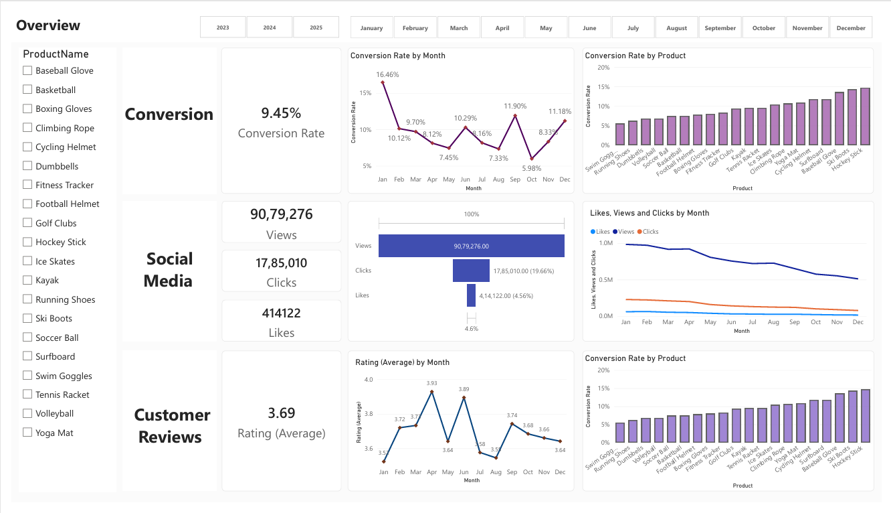
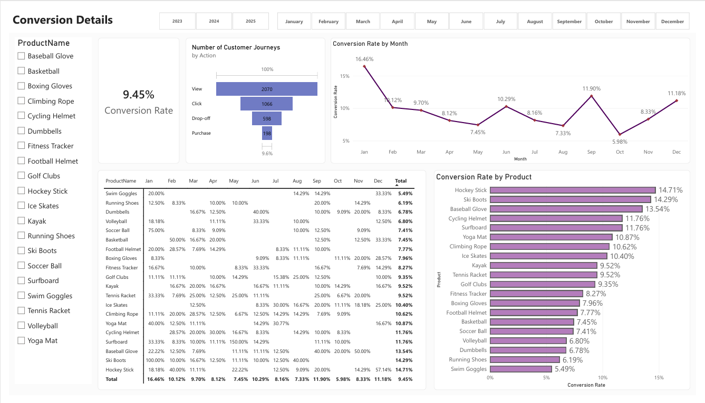
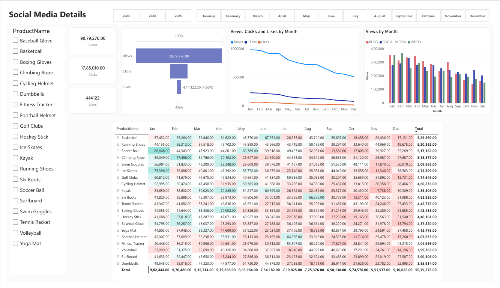
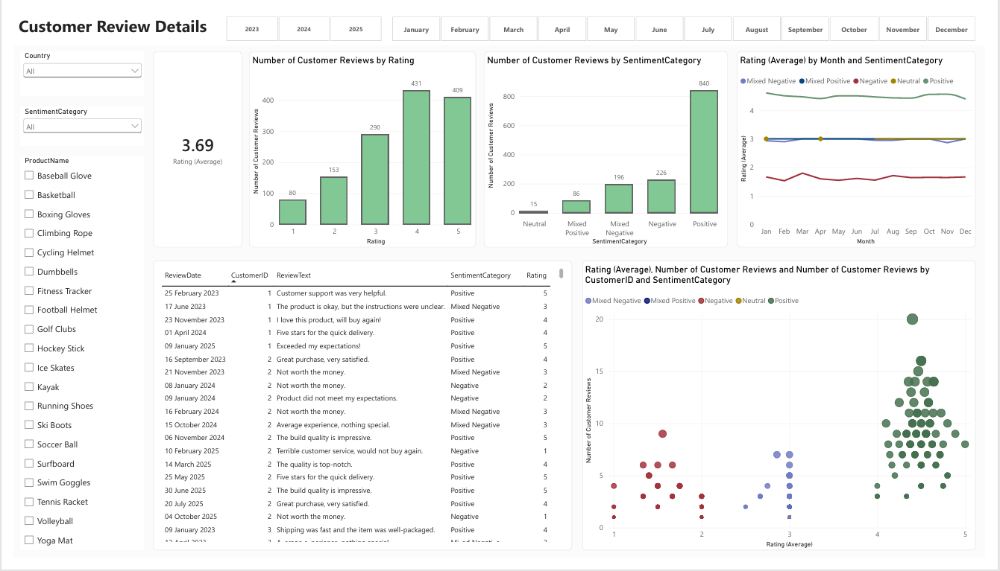

# 📊 Marketing Campaign Analytics

An end-to-end analytics project built to help an online retail business diagnose declining customer engagement and conversion rates and to guide data-driven improvements to its marketing strategy.

The project combines SQL Server (data storage & analysis), Python (customer review sentiment analysis) and Power BI (interactive dashboarding) into a single analytics pipeline.

## 📑 Table of Contents
* <a href="#business-problem">Business Problem</a>
* <a href="#project-goals">Project Goals</a>
* <a href="#project-workflow">Project Workflow</a>
* <a href="#sql-server-data-preparation- &amp; -analysis">SQl Server Data Preparation &amp; Analysis</a>
* <a href="#python-sentiment-analysis">Python - Sentiment Analysis</a>
* <a href="#dashboard-structure">Dashboard Structure</a>
* <a href="#insights- &amp; - key-findings">Insights- &amp; -key-findings</a>
* <a href="#goals- &amp; -recommended-actions">Goals &amp; Recommended Actions</a>
* <a href="#tools- &amp;-technologies">Tools \& Technologies</a>
* <a href="#project-structure">Project Structure</a>
* <a href="#author- &amp;-contact">Author \& Contact</a>


<h2><a class="anchor" id="business-problem"></a>📌Business Problem</h2>


An online retail business has launched several new marketing campaigns but is seeing:

- **Reduced Customer Engagement** - interactions with the site and marketing content have declined.
- **Decreased Conversion Rates** - fewer visitors are converting into paying customers.
- **High Marketing Expenses** - significant campaign spend without expected returns.
- **Unanalyzed Customer Feedback** - customer opinions on products/services aren't being systematically used to improve engagement and conversions.


<h2><a class="anchor" id="project-goals"></a> 🎯 Project Goals </h2>

| Goal | Insight Delivered |
|---|---|
| **Increase Conversion Rates** | Identify the factors impacting conversion and the stages where visitors drop off, with recommendations to optimize the funnel. |
| **Enhance Customer Engagement** | Determine which types of marketing content (Blog, Social Media, Video) drive the highest engagement to inform content strategy. |
| **Improve Customer Feedback Scores** | Surface recurring themes in customer reviews (positive & negative) to guide product and service improvements. |


<h2><a class="anchor" id="project-workflow"></a> 🔄 Project Workflow </h2>

The project follows an end-to-end data analytics workflow:

```text
                 Raw Data
                    │
                    ▼
             ┌──────────────┐
             │  SQL Server  │
             │ Cleaning &   │
             │   Analysis   │
             └──────┬───────┘
                    │
                    ▼
             ┌──────────────┐
             │    Python    │
             │   VADER NLP  │
             │  Sentiment   │
             └──────┬───────┘
                    │
                    ▼
          Enriched Customer Data
                    │
                    ▼
             ┌──────────────┐
             │   Power BI   │
             │ DAX + Data   │
             │   Modeling   │
             └──────┬───────┘
                    │
                    ▼
       Trends → Insights → Recommendations
```


<h2><a class="anchor" id="sql-server-data-preparation- &amp; -analysis"></a> 🗄️ SQL Server - Data Preparation &amp; Analysis </h2>
Used SQL Server to:

- Clean and transform customer, marketing, engagement and review data
- Integrate datasets using JOINs
- Identify duplicates using CTEs and ROW_NUMBER()
- Handle missing values using window functions and COALESCE()
- Create analytical features using CASE and string/date functions
- Prepare datasets for conversion, engagement, and customer journey analysis

<h2><a class="anchor" id="python-sentiment-analysis"></a> 🐍 Python - Sentiment Analysis </h2>
Customer reviews were analyzed using NLTK's VADER sentiment analyzer


| Score Range | Interpretation |
|---|---|
| **-1.0 to -0.5** | Strong Negative |
| **-0.49 to 0.0** | Negative / Neutral |
| **0.0 to 0.49** | Neutral / Positive |
| **0.5 to 1.0** | Strong Positive |

The resulting enriched dataset is exported as:

fact_customer_reviews_with_sentiment.csv

##### Python Libraries
- pandas - Data manipulation
- pyodbc - SQL Server connection
- nltk - Sentiment analysis

<h2><a class="anchor" id="dashboard-structure"></a> 📊 Dashboard Structure </h2>

The Power BI report contains three interconnected pages, all filterable by **Year (2023 / 2024 / 2025)**, **Month** and **Product**.

### 1️⃣ Overview
A single-page summary combining the three focus areas:
- **Conversion** - Overall Conversion Rate KPI, Conversion Rate by Month (trend) and Conversion Rate by Product (ranked bar chart).
- **Social Media** - Views, Clicks, and Likes KPIs with a funnel-style breakdown plus Likes/Views/Clicks trend by month.
- **Customer Reviews** - Average Rating KPI and Rating (Average) trend by month.


### 2️⃣ Conversion Details

A detailed analysis of conversion performance across products and time:

- Overall Conversion Rate KPI.
- **Conversion Rate by Month** to identify monthly trends and changes in performance.
- **Conversion Rate by Product** to compare product-level conversion performance.
- Year-over-year comparison of conversion performance.
- Identification of high and low performing products and periods.


### 3️⃣ Social Media Details
A deep dive into marketing content performance:
- Views, Clicks, and Likes KPIs with click-through/like-through funnel visualization.
- Views, Clicks, and Likes trend by month.
- **Views by Month split by content type** (Blog, Social Media, Video) to compare channel performance.
- Product-level matrix of monthly engagement totals, conditionally formatted to spot top/bottom performers at a glance.



### 4️⃣ Customer Review Details
A sentiment and ratings analysis view:
- Average Rating KPI.
- Number of Customer Reviews by Rating (1–5 star distribution).
- Number of Customer Reviews by Sentiment Category (Positive, Negative, Mixed Positive, Mixed Negative, Neutral).
- Rating (Average) by Month and Sentiment Category (trend lines).
- Scatter plot of Rating vs. Review Volume by Customer & Sentiment Category, to spot outlier customers/products.
- Detailed, filterable review table (Review Date, Customer ID, Review Text, Sentiment, Rating).



<h2><a class="anchor" id="key-insights"></a> 🧠 Insights &amp; Key Findings </h2>

- **Conversion rate has declined year over year**, from an average of ~11.4% (2023) to ~8.4% (2025), alongside a sharp drop in overall Views (from ~50L in 2023 to ~11L in 2025) - pointing to shrinking top-of-funnel traffic as a core driver of lower conversions.
- **Engagement metrics (Views, Clicks, Likes) have fallen in tandem**, suggesting the issue starts with content reach/visibility rather than on-site conversion mechanics alone.
- **Average customer rating has also trended down slightly** (3.73 → 3.66), with a consistent share of Negative and Mixed Negative sentiment each year - useful for identifying specific products or experiences to prioritize for improvement.
- **Product-level conversion rates vary widely**, highlighting opportunities to reallocate marketing spend toward consistently higher-converting products.

### 📌 Key Findings

| Metric | Finding |
|---|---:|
| 📉 **Conversion Rate** | Declined from **~11.4% (2023) → ~8.4% (2025)** |
| 👀 **Views** | Declined from **~50L (2023) → ~11L (2025)** |
| ⭐ **Average Rating** | Declined from **3.73 → 3.66** |
| 💬 **Reviews Analyzed** | **1,363** |
| 📊 **Overall Conversion Rate** | **9.45%** |


<h2><a class="anchor" id="goals- &amp; -recommended-actions"></a> ✅Goals &amp; Recommended Actions </h2>

| Goal | Recommended Action |
|---|---|
| **Increase Conversion Rates** | **Target high-performing product categories** - focus marketing efforts on products with demonstrated high conversion rates, such as Kayaks, Ski Boots and Baseball Gloves. Run seasonal promotions or personalized campaigns during peak months (e.g. January and September) to capitalize on these trends. |
| **Enhance Customer Engagement** | **Revitalize the content strategy** - to turn around declining views and low interaction rates, experiment with more engaging formats such as interactive videos or user-generated content. Boost engagement further by optimizing call-to-action placement in social media and blog content, particularly during historically lower-engagement months (September–December). |
| **Improve Customer Feedback Scores** | **Address mixed and negative feedback** - implement a feedback loop where mixed and negative reviews are analyzed to identify common issues. Develop improvement plans to address these concerns, follow up with dissatisfied customers to resolve issues and encourage re-rating, aiming to move average ratings closer to the 4.0 target. |

<h2><a class="anchor" id="tools- &amp;-technologies"></a> 🛠️ Tools &amp; Technologies </h2>
## 🛠️ Tools & Technologies

| Technology | Usage |
| :--- | :--- |
| 🗄️ SQL Server | Data storage, cleaning, transformation and analysis |
| 🐍 Python | Customer review sentiment analysis |
| 🐼 Pandas | Data manipulation and processing |
| 🔌 PyODBC | SQL Server–Python connection |
| 💬 NLTK / VADER | Sentiment analysis |
| 📊 Power BI | Data modeling, DAX, KPI analysis and dashboard development |
| 🔄 Power Query | Data transformation |
| 📗 Excel | Data preparation and validation |
| 🌐 Git & GitHub | Version control and project management |


<h2><a class="anchor" id="project-structure"></a> 📁Project Structure </h2>

```text
marketing-campaign-analytics/
├── README.md
├── sql/
│   └── cleaning_data.sql
├── python/
│   └── sentiment_analysis.py
├── data/
│   └── fact_customer_reviews_with_sentiment.csv
├── dashboard/
│   ├── dashboard.pbix
│   └── dashboard.pdf
└── Screenshots/
    ├── overview.png
    ├── conversion_details.png
    ├── social-media-details.png
    └──customer-review-details.png
```

<h2><a class="anchor" id="author- &amp;-contact"></a>Author &amp; Contact</h2>

**Vani Sharma**   
Data Analyst  
📧 Email: vanisharma2014@gmail.com  
🔗 [LinkedIn](https://www.linkedin.com/in/vani-sharma-82a790221/)

